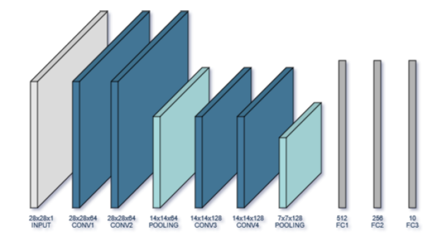
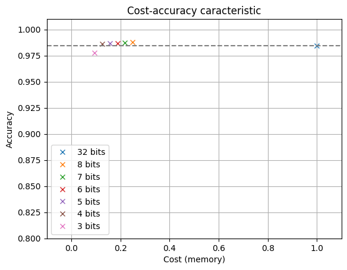

# Shift Quantization 

This repository presents  implementation to 
prof the concept of Shift Quantization. The full extent of the results are presented
***[here](https://github.com/Markis-Iustin-Ioan-30126/Shift-Quantization/blob/main/Shift_Quantization.pdf)***.

Shift Quantization is a technique used to reduce the
size of a convolutional neural network
(CNN), while trying to preserve its accuracy and 
improve computational speed. It is a specific type o
f quantization that reduces the
number of bits used to represent the weights and 
activations of a CNN by shifting the values to
a new range by multiplying them with a scaling 
factor(fixed offset), allowing a smaller number of
bits to represent each value

 A VGG-7 architecture featuring four convolutional
layers and three fully connected ones was used for our model.

## Incremental Network Quantization
In order to achieve faster computational times and compress a floating point precision neural network
with high performance while also keeping the loss in accuracy negligible we used the Incremental
Network Quantization technique. The implementation for this method was done using ***pytorch***.

To test those assumptions we trained a handwritten digit classifier using the
MNIST dataset in floating point precision to serve as a baseline and then the obtained model was
quantized so that we can measure those metrics by comparison.

After quantization, the size of the networks was compressed but the accuracy was not
affected ,we even obtained better results that the floating point precision baseline for a bit-width
ranging from 8 to 4. For the bit-width of 3 the loss in accuracy is negligible.

